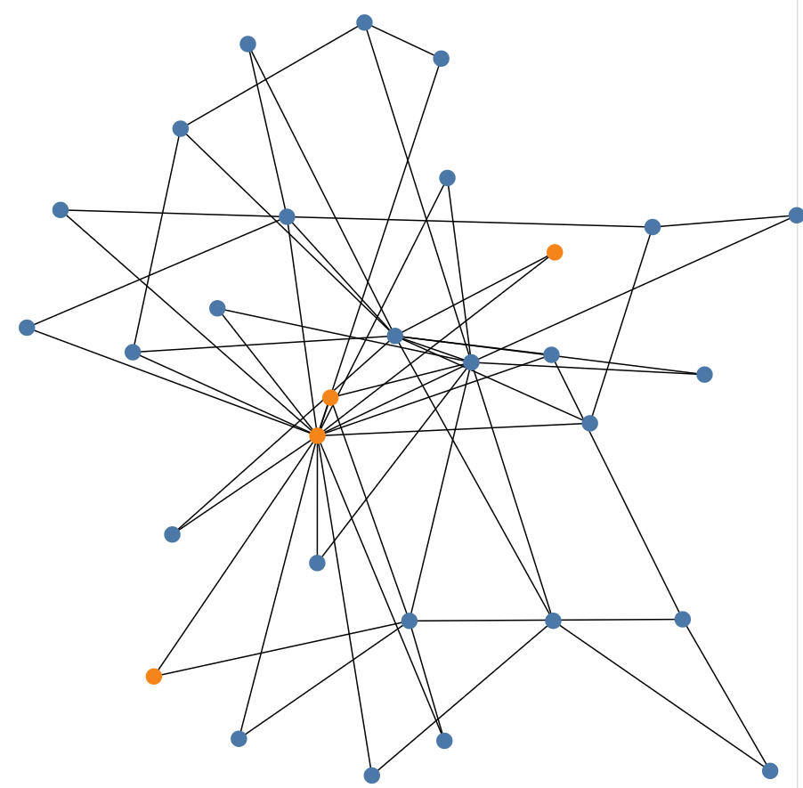

# README

## Simulation Assumptions

- Assuming a set of people forming a social network $G$.
    
- A new platform arises and tries to acquire users from $G$.
  People choose to join when their utility larger than their transition cost. That is:
  $$
  \sum w_iu_i \geq T_k
  $$
  
    Where $w_i$ stands for weights for each utility, $u_i$ represents utilities in different aspects, and $T_k$ is the transition cost for user $k$ to use this platform.
  
- Simplifications:
    - The utility is calculated as
    
        $$
        w_1\log N_{\text{platform}}+w_2 \log N_{\text{conn}} + w_3s
        $$
    
        Where $N_{\text{platform}}$ stands for the current size of the platform, $N_{\text{conn}}$ means the current number of people that this person knows that are on this platform, and $s$ means a subsidy from the platform.
    
    - The transition cost for everyone is randomly picked from $\operatorname{unif}\{a, b\}$, where $a$ the lowerbound and $b$ the upperbound.